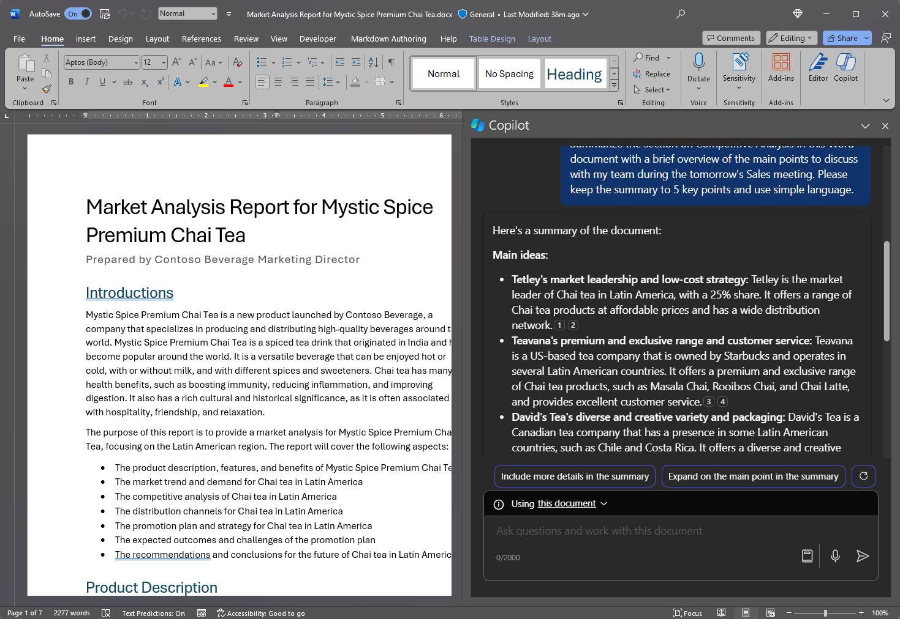

لبدء استخدام Microsoft 365 Copilot في Word، يمكنك فتح جزء **Copilot** عن طريق تحديد أيقونة Copilot في علامة التبويب **الصفحة الرئيسية** على الشريط. 

توفر هذه الميزة المفيدة إجابات على الأسئلة - العامة أو المحددة - حول مستندك. يمكنك إجراء حوار تفاعلي متبادل لتكرار النتائج وتحسينها، أو الحصول على ملخص أو معلومات محددة حول محتوى المستند، أو اطلب منه توليد أفكار أو جداول أو قوائم يمكنك نسخها وإدراجها في المستند.

في المثال التالي، نقوم بتحويل مطالبة أساسية لـ Copilot في Word إلى مطالبة سياقية جيدة البناء تمنحك ما تحتاج إليه بالضبط بالطريقة التي تحتاجها بالضبط.

## دعونا نبدأ في الصياغة

أولًا، نزّل **_[Market Analysis Report for Mystic Spice Premium Chai Tea.docx](https://go.microsoft.com/fwlink/?linkid=2268826)_** واحفظ الملف في **مجلد OneDrive** إذا لم تكن قد فعلت ذلك بعد.

افتح المستند في Word ثم افتح جزء **Copilot** من خلال تحديد أيقونة Copilot في علامة التبويب **الصفحة الرئيسية** على الشريط. أدخل التعليمات أدناه واتبعها.

> [!NOTE]
> مطالبة البدء:
>
> _تلخيص مستند Word هذا._

في هذه المطالبة البسيطة، ستبدأ **بالهدف** الأساسي: _لتلخيص مستند Word._ ومع ذلك، لا توجد معلومات حول سبب الحاجة إلى تلخيص المستند أو ما هو الغرض من هذا الملخص.

| العنصر | مثال |
| :------ | :------- |
| المطالبة الأساسية:  البدء **بهدف** | **تلخيص مستند Word هذا.** |
| المطالبة الجيدة:  أضف **السياق** | إن إضافة **السياق** قد يساعد Copilot في فهم غرض الملخص وتخصيص الرد وفقًا لذلك.  "_مع لمحة موجزة عن النقاط الرئيسية التي يجب مناقشتها مع فريقي خلال اجتماع المبيعات غدًا._" |
| المطالبة الأفضل:  تحديد **المصدر (المصادر)** | إن إضافة **المصادر** قد يساعد Copilot في فهم المستند أو الجزء الذي يحتاج إلى تلخيص وتوفير رد أكثر دقة.  "_...القسم الخاص بالتحليل التنافسي..._" |
| أفضل مطالبة:  حدّد **توقعات** واضحة | وأخيرًا، قد تساعد إضافة **التوقعات** Copilot في فهم كيفية تنسيق الملخص ومستوى التفاصيل المطلوب.  "_يرجى إبقاء الملخص في 5 نقاط رئيسية واستخدام لغة بسيطة._" |

> [!NOTE]
> **المطالبة المصممة**:
>
> _لخّص القسم الخاص بالتحليل التنافسي في مستند Word هذا مع لمحة عامة موجزة عن النقاط الرئيسية التي يجب مناقشتها مع فريقي أثناء اجتماع المبيعات غدًا. يُرجى حصر الملخص في 5 نقاط رئيسية واستخدام لغة بسيطة._

تحتوي هذه المطالبة على كل التفاصيل التي يحتاجها - **الهدف**، و**السياق**، و**المصدر**، و**التوقعات** - حتى يتمكن Copilot من إعطائك الرد التي تبحث عنه. 

## استكشاف المزيد

جرّب المطالبة النهائية التي قمنا بتصميمها، ولكن باستخدام مستند Word الخاص بك. خصّص **السياق**، و**المصادر**، و**التوقعات** حتى تحصل على ما تحتاج إليه من المستند، دون أي أشياء إضافية لا تحتاجها.

ما هي بعض الطرق الأخرى التي يمكنك التفكير فيها لإضافة السياق أو المصادر أو التوقعات إلى مطالبتك؟ هل يمكنك أن تفكر في استراتيجيات تحفيزية أخرى يمكنك استخدامها لتوليد الرد المطلوب؟

> [!IMPORTANT]
> تتوفر هذه الميزة للعملاء الذين لديهم ترخيص Copilot لـ Microsoft 365 أو ترخيص Copilot Pro. لمزيد من المعلومات، راجع [مرحبًا بك في Copilot في Word](https://support.microsoft.com/en-us/office/welcome-to-copilot-in-word-2135e85f-a467-463b-b2f0-c51a46d625d1).

في الوحدة التالية، سننظر في كيفية إنشاء مطالبات مماثلة لـ Copilot في PowerPoint.