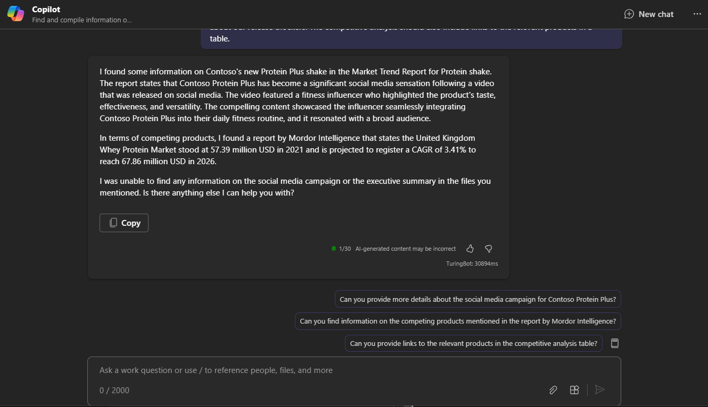

# لخّص المعلومات حول موضوع ما باستخدام Microsoft 365 Copilot Chat

يجمع Microsoft 365 Copilot Chat (Copilot Chat) بين قوة الذكاء الاصطناعي (AI) وبيانات العمل والتطبيقات لمساعدتك على إطلاق العنان للإبداع و الإنتاجية ورفع مستوى المهارات. وهي تعمل عبر تطبيقات ومحتوى متعددين، مما يمنحك قوة الذكاء الاصطناعي وي نفس الوقت أمان بيانات عملك. إن قدرتها على تجميع المعلومات وإنشاء أشياء من مصادر متعددة في وقت واحد تمكنك من تحقيق الأهداف والغايات الأوسع.

للمقارنة، تم تنسيق Copilot في تطبيقات Microsoft 365 المختلفة (مثل Word أو PowerPoint) خصيصًا لمساعدتك **داخل هذا التطبيق الواحد**. على سبيل المثال، تم تصميم Copilot في Word لمساعدتك على صياغة مستودة المحتوى وتحريره واستهلاكه بشكل أفضل. أما في PowerPoint، فهو موجود لمساعدتك في إنشاء عروض تقديمية أفضل. ولكن مع Copilot Chat، يمكننا جمع كل ذلك معًا في تجربة جديدة.

يمكنك الوصول إلى Copilot Chat بعدة طرق:

- استخدم Copilot Chat في إصدارات سطح المكتب والهواتف المحمولة من Microsoft Teams. راجع [استخدام Copilot Chat في Teams](https://support.microsoft.com/topic/open-microsoft-365-chat-in-teams-c6de0a62-4f9e-479d-b5f2-af036e342181).

- يمكنك الوصول إلى Copilot Chat على Microsoft365.com/copilot. راجع [استخدام Copilot Chat على Microsoft.com/Copilot](https://support.microsoft.com/topic/use-microsoft-365-chat-at-microsoft365-com-or-in-the-microsoft-365-office-app-4a2538f9-962f-4c7c-a368-f6006bc13d6f).

## دعونا نبدأ في الصياغة

أولًا، نزّل الملفات التالية واحفظها في مجلد **OneDrive** وأضفها إلى قائمة MRU الخاصة بك:

- [Contoso Chai Tea market trends 2023.xlsx](https://go.microsoft.com/fwlink/?linkid=2268822)

- [Contoso Chai Tea market trends 2023.docx](https://go.microsoft.com/fwlink/?linkid=2269122)

- [Market Trend Report- Protein shake.docx](https://go.microsoft.com/fwlink/?linkid=2268827)

افتح تطبيق Copilot Chat في Microsoft Teams واتبع الإرشادات التي تشير إلى الملفات أعلاه.

> [!NOTE]

> مطالبة البدء:

>

> _ابحث عن المعلومات وتجميعها حول مشروب Protein Plus الجديد من Contoso._

في هذه المطالبة البسيطة، ستبدأ **بالهدف** الأساسي: _لتلخيص المعلومات حول منتج جديد._ ومع ذلك، لا توجد معلومات حول سبب حاجتك إلى الملخص أو ما تبحث عنه.

| العنصر | مثال |

| :------ | :------- |

| **المطالبة الأساسية:** ابدأ **بهدف** | **ابحث عن المعلومات وتجميعها حول مشروب Protein Plus الجديد من Contoso.** |

| **المطالبة الجيدة:** أضف **سياق** | قد يساعد إضافة **السياق** Copilot في فهم الغرض وتعديل الرد وفقًا لذلك. _"...لمراجعة أعمال ربع سنوية قادمة. نحتاج إلى ملخص تنفيذي، بالإضافة إلى تفاصيل حول حملة وسائل التواصل الاجتماعي والمنتجات المنافسة."_ |

| **مطالبة أفضل:** حدد **المصدر(المصادر)** | قد تساعد إضافة **المصادر** Copilot في فهم المكان الذي يجب البحث فيه عن المعلومات وتوفير رد أكثر دقة. _"ابحث عن المعلومات في **/Market Analysis Report for Mystic Spice Premium Chai Tea.docx**، **/Contoso Chai Tea market trends 2023.xlsx**، و **/Market Trend Report - Protein shake.docx** لكتابة الملخص التنفيذي."_ |

| **أفضل مطالبة:** عيّن **توقعات** واضحة | وأخيرًا، قد تساعد إضافة **التوقعات** Copilot في فهم كيفية تنسيق الملخص ومستوى التفاصيل المطلوب. _يجب أن يبدو الملخص احترافيًا، مع نبرة متفائلة بشأن عوائق الإصدار لدينا. يجب أن يتضمن التحليل التنافسي أيضًا روابط للمنتجات ذات الصلة في جدول._ |

> [!NOTE]

> **المطالبة المصممة**:

>

> _ابحث عن معلومات حول مشروب Protein Plus الجديد من Contoso وجمّعها لمراجعة الأعمال ربع السنوية القادمة. نحتاج إلى ملخص تنفيذي، بالإضافة إلى تفاصيل حول الحملة الإعلانية على وسائل التواصل الاجتماعي والمنتجات المنافسة. ابحث عن المعلومات في **/Market Analysis Report for Mystic Spice Premium Chai Tea.docx** و **/Contoso Chai Tea market trends 2023.xlsx** و **/Market Trend Report - Protein shake.docx** لكتابة الملخص التنفيذي. يجب أن يبدو الملخص احترافيًا، مع نبرة أمل حول موانع الإصدار لدينا. وينبغي أن يتضمن التحليل التنافسي أيضا روابط بالمنتجات ذات الصلة في جدول._

مع تحديد **الهدف** و**السياق** و**المصدر** و**التوقعات**، فإن Copilot لديه كل ما يحتاجه ليمنحك ردًا رائعًا.

## استكشاف المزيد

يمكنك أيضًا استخدام Copilot للحصول على ملخصات ومعرفة الأمور بسرعة. ويمكنه تجميع ملخصات سريعة للمشاريع والاجتماعات ورسائل البريد الإلكتروني والدردشات والمزيد. استخدمه لمعرفة ما يجب عليك فعله، أو الحصول على آخر التحديثات حول مشروع ما، أو العثور على الاتصالات الأخيرة من زميل أو مدير بسرعة.

وفيما يلي بعض الأمثلة الأخرى:

- _في الأسبوع الماضي، شارك أحد الأشخاص مستندًا يحدد تواريخ التسليم الرئيسية للمشروع X. ما هي تلك التواريخ؟_

- _لخّص الرسائل التي تلقيتها من سام خلال الأسبوعين الماضيين. اذكر أي تفاصيل مهمة، مثل المهام المطلوبة ومواعيد الاستحقاق وعناصر العمل التي يتعين عليّ القيام بها_.

- _أدرج التطورات في منتج Z التي قد تكون ذات صلة بالمدير التنفيذي الذي يملك إطلاق المنتج، استنادًا إلى التعاون على مدار الأيام الخمسة الماضية_.

