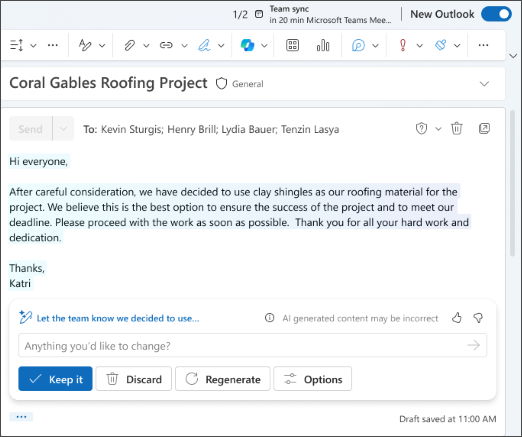

# كتابة مسودة رسائل البريد الإلكتروني والردود وجداول أعمال الاجتماعات باستخدام Microsoft 365 Copilot في Outlook

تجعل أدوات Copilot في Outlook إدارة البريد الوارد أسهل باستخدام مساعدة قائمة على تكنولوجيا الذكاء الصناعي لمساعدتك في كتابة الرسائل إلكترونية بسرعة وتحويل سلاسل الرسائل إلكترونية الطويلة إلى ملخصات قصيرة. فهو يجمع بين قوة نماذج اللغة الكبيرة (LLMs) وبيانات Outlook لمساعدتك على الحفاظ على الإنتاجية في مكان العمل. يمكنه تلخيص سلاسل الرسائل الإلكترونية (المعروفة أيضًا باسم المحادثات)، واستخراج النقاط الرئيسية من رسائل متعددة.

> [!NOTE]
> تتوفر الصياغة في Outlook لـ Microsoft 365 حاليًا في Outlook الجديد لنظام التشغيل Windows، و Outlook على الويب، و Outlook.com. إذا كان لديك Outlook الكلاسيكي، [فاحصل على Outlook الجديد](https://support.microsoft.com/office/start-using-new-outlook-for-windows-4395454d-cb2f-4c16-bb24-fa4bb36650ae). إذا لم تتمكن من الوصول، فتحقق من ذلك مع مسؤول تكنولوجيا المعلومات لديك.

يمكن أن يساعدك Copilot في Outlook على صياغة رسالة إلكترونية بسرعة أو الرد على محادثة موجودة.

1. في Outlook، حدد **الصفحة الرئيسية > رسالة إلكترونية جديدة > رسالة إلكترونية**.

1. لبدء رسالة جديدة، حدد **أيقونة Copilot** من شريط الأدوات.

1. حدد **صياغة مسودة بواسطة Copilot** من القائمة المنسدلة.

    

1. في مربع Copilot، **اكتب مطالبتك**.

1. حدد **إنشاء الخيارات** لاختيار الطول وأسلوب الخطاب المطلوبين.

    

1. عند الانتهاء، حدّد **إنشاء**. يقوم Copilot بصياغة رسالة من أجلك.

1. راجع الرسالة. إذا لم يكن الأمر كما تريد تمامًا، فاختر **إعادة كتابة مسودة** وسيقوم Copilot بإنشاء نسخة جديدة.

1. للبدء من جديد، قم بتغيير مطالبتك وحدد **إنشاء** مرة أخرى.

1. بمجرد رضاك عن النتيجة، حدد **احتفظ**.

1. قم بتحرير المسودة حسب الحاجة، ثم حدد **إرسال**.

    

## دعونا نبدأ في الصياغة

> [!NOTE]
> مطالبة البدء:
>
> _كتابة مسودة بريد إلكتروني جديدة._

في هذه المطالبة البسيطة، ستبدأ **بالهدف** الأساسي: _لكتابة مسودة بريد إلكتروني جديدة._ ومع ذلك، لا توجد معلومات حول ما ستكون عليه رسالة البريد الإلكتروني، أو الأشخاص الذين تريد إرسالها إليه، أو ما تريد أن يبدو عليه.

| العنصر | مثال |
| :------ | :------- |
| **المطالبة الأساسية:** ابدأ **بهدف** | **_كتابة مسودة بريد إلكتروني جديدة._** |
| **المطالبة الجيدة:** أضف **سياق** | يمكن أن تساعد إضافة **السياق** Copilot في فهم محتوى البريد الإلكتروني ومن هو الجمهور المستهدف. _"...إلى عميلي، آلان دي يونج، بخصوص حالة تذكرة الدعم الخاصة به."_ |
| **مطالبة أفضل:** حدد **المصدر(المصادر)** | إن إضافة **المصادر** قد يساعد Copilot في معرفة المكان الذي يجب البحث فيه عن معلومات محددة. _"راجع آخر تحديث من ملاحظاتي: لقد تم تصعيد المشكلة إلى دعم المستوى 2، ومن المتوقع التوصل إلى حل خلال 48 ساعة."_ |
| **أفضل مطالبة:** عيّن **توقعات** واضحة | وأخيرًا، قد تساعد إضافة **التوقعات** Copilot في فهم كيفية كتابة المستند وتنسيقه. _يجب أن يبدو البريد الإلكتروني احترافيًا وتقنيًا، ولكن يجب كتابته بتعاطف._ |

> [!NOTE]
> **المطالبة المصممة**:
>
> _أرسل رسالة بريد إلكتروني جديدة إلى عميلي، آلان ديونغ، بخصوص حالة تذكرة الدعم. راجع آخر تحديث من ملاحظاتي: تم تصعيد المشكلة إلى دعم المستوى الثاني، ومن المتوقع حلها خلال 48 ساعة. يجب أن تبدو الرسالة احترافية وفنية، ولكن مكتوبة بتعاطف._

في هذه المطالبة، يحتوي Copilot على كل المعلومات التي يحتاجها لإعطائك ردًا قويًا، وذلك بفضل **الهدف** و**السياق** و**المصدر** و**التوقعات** في هذه المطالبة.

> [!IMPORTANT]
> يدعم Copilot في Outlook حسابات العمل أو المؤسسة التعليمية فقط، وحسابات Microsoft التي تستخدم عناوين البريد الإلكتروني outlook.com، و hotmail.com، و live.com، و msn.com في الوقت الحالي. لا يزال بإمكان أي حساب Microsoft يستخدم حسابًا من موفر بريد إلكتروني تابع لجهة خارجية، مثل Gmail أو Yahoo أو iCloud، استخدام Outlook، ولكنه لن يتمكن من الوصول إلى ميزات Copilot في Outlook. لمزيد من المعلومات، راجع [كتابة مسودة رسالة بريد إلكتروني باستخدام Copilot في Outlook](https://support.microsoft.com/office/draft-an-email-message-with-copilot-in-outlook-3eb1d053-89b8-491c-8a6e-746015238d9b).
