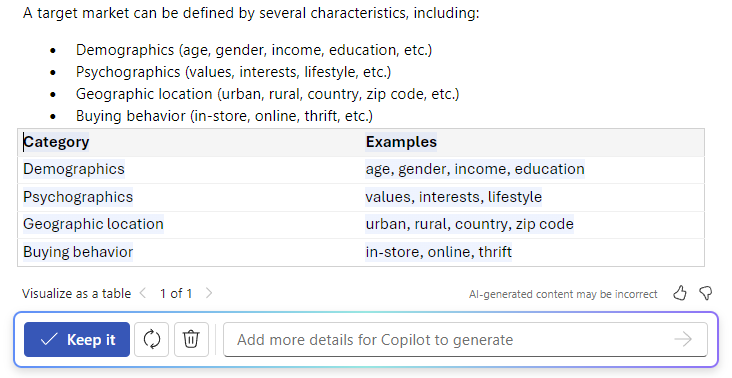

يتيح لك Microsoft 365 Copilot في Word البقاء على تواصل مع تدفق الأفكار أثناء صياغة محتوى جديد وتحويل المحتوى الخاص بك بمجرد كتابة أفكارك. يمكن لبرنامج Copilot إعادة كتابة نصك، بما في ذلك التعديلات على النبرة. يمكن لـ Copilot أيضًا تحويل النص إلى جدول قابل للتحرير. اتبع الخطوات لتحويل محتواك في Word:

## إعادة الكتابة من أجل النبرة

1. حدد النص الذي تريد أن يقوم Copilot بإعادة كتابته.

1. في الهامش الأيسر بجوار النص، حدد أيقونة **Copilot**.

1. من قائمة Copilot الموجودة في الهامش الأيسر، حدد **إعادة الكتابة**.

1. يُظهر لك برنامج Copilot خيارات تمت إعادة كتابتها للاختيار من بينها.

1. حدد **استبدال** لاستخدام النص المنقح، أو **إدراج أدناه** لإدراج النص المعاد كتابته أسفل النص الحالي، أو **إعادة إنشاء** لإعادة إنشاء اقتراحات Copilot، أو **ضبط النبرة** لضبط النص المعاد كتابته إلى النبرة المطلوبة.

    

## نص إلى جدول

1. حدد النص الذي تريد من Copilot تحويله إلى جدول.

1. في الهامش الأيسر بجوار النص، حدد أيقونة **Copilot**.

1. من قائمة Copilot في الهامش الأيسر، حدد **اعرض كجدول**.

1. يظهر لك Copilot شكل الجدول.

1. حدد **الاحتفاظ به** لإدراج الجدول في مستندك، أو **إعادة إنشاء** لإعادة إنشاء جدول Copilot، أو **تجاهل** لإزالة الجدول.

1. لضبط الجدول بشكل دقيق، أدخل التفاصيل في مربع كتابة Copilot لتحديد ما يجب تغييره حول الجدول.

    1. تغيير تنسيق جدول غير مدعوم باستخدام مربع الكتابة، ولكن يمكن تغيير تنسيق الجدول باستخدام خيارات الجدول في شريط Word.

    

في المثال التالي، نبدأ بمطالبة بسيطة لتحويل بعض النصوص إلى جدول وإضافة عناصر على طول الطريق. تابع المثال باستخدام بياناتك الخاصة.

## دعونا نبدأ في الصياغة

أولاً، نزّل **_[Graphic Design Institute - Employee Benefits.docx](https://go.microsoft.com/fwlink/?linkid=2268825)_** واحفظ الملف في **مجلد OneDrive** إذا لم تكن قد فعلت ذلك بعد.

افتح المستند في Word وميّز كل النص في المستند (اضغط على **Ctrl-A**). من قائمة Copilot في الهامش الأيسر، حدد **اعرض كجدول**. بعد إنشاء الجدول، تابع مع Copilot باستخدام المطالبات أدناه لتحسين النتائج.

> [!NOTE]
> مطالبة البدء:
>
> _تصورها كجدول._

في هذه المطالبة البسيطة، ستبدأ **بالهدف** الأساسي: _لتحويل النص إلى جدول._ ومع ذلك، لا توجد إشارة إلى المعلومات التي تريدها في الجدول أو لماذا يجب أن يكون جدولًا.

| العنصر | مثال |
| :------ | :------- |
| المطالبة الأساسية:  البدء **بهدف** | **_تصورها كجدول._** |
| المطالبة الجيدة:  أضف **السياق** | يمكن أن تساعد إضافة **السياق** Copilot في فهم نوع البيانات التي يجب رؤيتها وما سيتم استخدامها من أجله.  "_نحن بحاجة إلى طريقة واضحة لتوصيل هذه الفوائد للموظفين المحتملين._" |
| المطالبة الأفضل:  تحديد **المصدر (المصادر)** | **المصدر** في هذا المثال هو النص الكامل لـ **Graphic Design Institute - Employee Benefits.docx**. |
| أفضل مطالبة:  حدّد **توقعات** واضحة | وأخيرًا، قد تساعد إضافة **التوقعات** Copilot في فهم كيفية تنظيم الجدول وكتابته.  "_أدرج عمودًا ثالثًا يصف بوضوح الفائدة التي تعود على الموظف وكيف تؤثر على رفاهيته._" |

> [!NOTE]
> **المطالبة المصممة**:
>
> _تصورها كجدول. نحتاج إلى طريقة واضحة لتوصيل هذه الفوائد للموظفين المحتملين. ضمّن عمودًا ثالثًا يصف بوضوح الفائدة التي تعود على الموظف وكيف تؤثر على رفاهيته._

تمنح هذه المطالبة برنامج Copilot كل ما يحتاجه للتوصل إلى رد جيد، بما في ذلك **الهدف**، و**السياق**، و**المصدر**، و**التوقعات**.

> [!Important]
> تتوفر هذه الميزة للعملاء الذين لديهم ترخيص Microsoft 365 Copilot أو ترخيص Copilot Pro. لمزيد من المعلومات، راجع [تحويل المحتوى الخاص بك باستخدام Copilot في Word](https://support.microsoft.com/office/transform-your-content-with-copilot-in-word-923d9763-f896-4da7-8a3f-5b12c3bfc475).