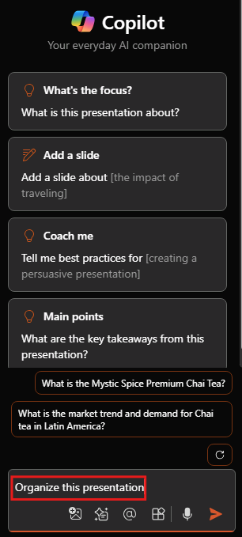

# احصل على نصائح حول التصميم والتنظيم باستخدام Microsoft 365 Copilot في PowerPoint

لبدء الدردشة مع Copilot في PowerPoint، يمكنك فتح جزء **Copilot** عن طريق تحديد أيقونة Copilot في علامة التبويب **الصفحة الرئيسية** على الشريط.

أثناء إنشاء عرض تقديمي، قد لا تكون متأكدًا من كيفية تنظيم شرائح العرض في أقسام. يمكن أن يساعد Copilot في PowerPoint. يمكنك أن تطلب من Copilot تنظيم العرض التقديمي. سيقوم بتنظيمه في أقسام، ثم يضيف شرائح عرض لعناوين الأقسام.

1. في الشريط، حدد زر Copilot.

1. سيتم فتح جزء Copilot على الجانب الأيمن من الشاشة.

1. اكتب **نظم هذا العرض التقديمي** في حقل المطالبة في أسفل جزء Copilot.

1. حدد **إرسال**.

إذا لم يعجبك ما يفعله Copilot، يمكنك ببساطة تحديد **زر التراجع** على الشريط لإعادة مجموعة شرائح العرض إلى حالتها السابقة.

## دعونا نبدأ في الصياغة

إذا لم تقم بذلك بعد، نزّل الملفات التالية واحفظها في **مجلد OneDrive** الخاص بك حتى تظهر في قائمة MRU الخاصة بك:

- **_[Mystic Spice Premium Chai Market Analysis Presentation.pptx](https://go.microsoft.com/fwlink/?linkid=2268768)_**
- **_[Mystic Spice Premium Chai Tea product description.docx](https://go.microsoft.com/fwlink/?linkid=2268929)_**

> [!NOTE]
> مطالبة البدء:
>
> _تنظيم عرض PowerPoint هذا._

في هذه المطالبة البسيطة، ستبدأ **بالهدف** الأساسي: _لتنظيم عرض PowerPoint_. ومع ذلك، لا توجد معلومات حول سبب الحاجة إلى تلخيص العرض التقديمي أو ما هو الملخص المطلوب.

| العنصر | مثال |
| :------ | :------- |
| **المطالبة الأساسية:** ابدأ **بهدف** | **تنظيم عرض PowerPoint هذا.** |
| **المطالبة الجيدة:** أضف **سياق** | إن إضافة **السياق** قد يساعد Copilot في فهم الطريقة التي تريد بها تنظيم المجموعة والسبب وراء القيام بذلك. _"لمراجعة المنتج التنفيذية الأسبوع المقبل"_ |
| **مطالبة أفضل:** حدد **المصدر(المصادر)** | قد تساعد إضافة **المصادر** Copilot في البحث في موقع محدد، مثل مواصفات المنتج أو الكتالوج. _"راجع **/Mystic Spice Premium Chai Tea product description.docx** للحصول على معلومات عن المنتج."_ |
| **أفضل مطالبة:** عيّن **توقعات** واضحة | وأخيرًا، قد تساعد إضافة **التوقعات** Copilot في فهم كيفية هيكلة العرض التقديمي ومستوى التفاصيل التي يجب تضمينها. _رتّب الشرائح حسب المنتج وضمّن نظرة عامة وقائمة بالميزات والفوائد الرئيسية وتعليقات العملاء ومقارنة بالمنتجات المماثلة في السوق._ |

> [!NOTE]
> **المطالبة المصممة**:
>
> _نظّم هذا العرض التقديمي لمراجعة المنتج التنفيذي في الأسبوع المقبل. راجع **/Mystic Spice Premium Chai Tea product description.docx** للحصول على معلومات المنتج. رتّب الشرائح حسب المنتج وأضف نظرة عامة وقائمة بالميزات والفوائد الرئيسية وتعليقات العملاء ومقارنة بالمنتجات المماثلة في السوق._

في هذه المطالبة، يتم توفير **الهدف** و**السياق** و**المصدر** و**التوقعات**، مما يمنح Copilot توجيهًا كافيًا لتوليد رد يلبي احتياجاتك.

## استكشاف المزيد

جرّب المطالبة النهائية التي قمنا بتصميمها، ولكن باستخدام عرض PowerPoint الخاص بك. خصّص **السياق**، و**المصادر**، و**التوقعات** حتى تحصل على ما تحتاج إليه من العرض التقديمي، دون أي أشياء إضافية لا تحتاجها.

> [!IMPORTANT]
> تتوفر هذه الميزة للعملاء الذين لديهم ترخيص Microsoft 365 Copilot أو ترخيص Copilot Pro. لمزيد من المعلومات، راجع [تنظيم هذا العرض التقديمي باستخدام Copilot في PowerPoint](https://support.microsoft.com/office/organize-this-presentation-with-copilot-in-powerpoint-a207eea3-7a56-4225-88f1-54dd37cdcf6a).
